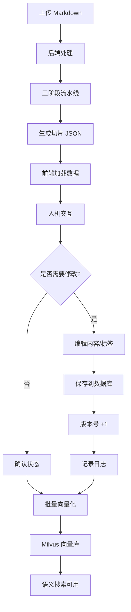

# HIT-RAG UI: 可视化人机交互界面

HIT-RAG (Human-in-the-Loop RAG) 系统的前端可视化界面，为文档处理、切片审核、标签管理和语义搜索提供直观的 Web 操作体验。

## ✨ 核心功能

- **📄 文档管理**：可视化浏览和处理 Markdown 文档，实时查看处理状态
- **✏️ 智能编辑器**：基于 TipTap 的富文本编辑，支持 Markdown、表格、图片
- **🔍 版本对比**：完整的版本历史追踪，可视化 Diff 高亮显示变更
- **🏷️ 标签系统**：灵活的标签管理（文档级 + 切片级），支持全局操作
- **🎯 精准定位**：点击切片自动高亮原文位置，支持双向导航
- **🚀 批量操作**：批量向量化、批量状态管理，提升审核效率
- **📊 统计面板**：实时展示切片统计、Token 分布、向量化进度

## 🎨 界面预览

```
┌─────────────────────────────────────────────────────────────────┐
│  HIT-RAG 文档处理系统                    [标签管理] [语义搜索]   │
├──────────────┬─────────────────────┬──────────────────────────────┤
│              │                     │                              │
│  文档面板    │    原文预览面板     │     切片管理面板             │
│              │                     │                              │
│ 📁 文档列表  │  # 文档标题         │  🔍 搜索: [________]         │
│              │                     │                              │
│ • doc1.md ✅ │  ## 第一章          │  📊 统计:                    │
│ • doc2.md ⏳ │  这是文档内容...    │   总数: 45  已确认: 20       │
│ • doc3.md ❌ │                     │   已向量化: 15  Token: 12K   │
│              │  ## 第二章          │                              │
│ [处理文档]   │  更多内容...        │  ┌──────────────────────┐   │
│              │                     │  │ Chunk #1  [300T]     │   │
│              │  [高亮区域]         │  │ 技术文档 | RAG       │   │
│              │                     │  │ 这是第一个切片...    │   │
│              │                     │  └──────────────────────┘   │
│              │                     │                              │
│              │                     │  [批量向量化] [导出]         │
└──────────────┴─────────────────────┴──────────────────────────────┘
```

## 🏗️ 技术架构

### 技术栈

| 技术 | 版本 | 用途 |
|------|------|------|
| **Vue 3** | ^3.4 | 前端框架（Composition API） |
| **Vite** | ^5.0 | 构建工具和开发服务器 |
| **TipTap** | ^2.1 | 富文本编辑器（基于 ProseMirror） |
| **marked.js** | ^11.0 | Markdown 渲染 |
| **diff-match-patch** | - | 文本 Diff 算法 |

### 组件架构

```
App.vue (根组件)
│
├── DocumentSelector.vue          # 左侧：文档管理
│   ├── 文档列表（状态徽章）
│   ├── 处理按钮（触发后台任务）
│   └── 文档标签管理
│
└── ChunksPanel.vue                # 右侧：切片管理
    ├── 搜索和过滤
    ├── 统计信息
    ├── 切片卡片列表
    │   └── ChunkCard.vue × N
    ├── 切片编辑器（模态框）
    │   └── ChunkEditor.vue
    │       ├── TipTap 编辑器
    │       ├── 工具栏（格式化、表格、图片）
    │       ├── 状态管理（废弃、确认）
    │       └── 导航（上一条/下一条）
    ├── 版本历史
    │   └── ChunkVersionHistory.vue
    └── 标签管理器
        ├── TagManager.vue          # 文档级标签
        └── GlobalTagManager.vue    # 全局标签操作
```

### 状态管理

使用 Vue 3 Composition API 进行响应式状态管理：

```javascript
// App.vue 中的全局状态
const currentDocument = ref('')          // 当前选中的文档
const processedChunks = ref([])          // 切片数据
const selectedChunk = ref(null)          // 当前选中的切片
const documentTags = ref([])             // 文档标签
const globalTags = ref([])               // 全局标签池

// 组合式函数（Composables）
useTags()        // 标签管理逻辑
useHighlight()   // 高亮定位逻辑
useImageLoader() // 图片加载逻辑
```

## 📋 项目结构

```
hit-rag-ui/
├── src/
│   ├── components/                # Vue 组件
│   │   ├── DocumentSelector.vue  #   文档选择器
│   │   ├── DocumentPanel.vue     #   原文展示面板
│   │   ├── ChunksPanel.vue       #   切片管理面板
│   │   ├── ChunkCard.vue         #   切片卡片
│   │   ├── ChunkEditor.vue       #   富文本编辑器
│   │   ├── ChunkDetailModal.vue  #   切片详情弹窗
│   │   ├── ChunkVersionHistory.vue # 版本历史
│   │   ├── TagManager.vue        #   文档标签管理
│   │   ├── GlobalTagManager.vue  #   全局标签管理
│   │   └── SemanticSearch.vue    #   语义搜索
│   │
│   ├── composables/               # 组合式函数
│   │   ├── useHighlight.js       #   高亮定位逻辑
│   │   ├── useImageLoader.js     #   图片加载逻辑
│   │   ├── useLazyImage.js       #   图片懒加载
│   │   └── useTags.js            #   标签状态管理
│   │
│   ├── utils/                     # 工具函数
│   │   ├── config.js             #   API 配置
│   │   └── diffHighlight.js      #   Diff 高亮算法
│   │
│   ├── App.vue                    # 根组件
│   ├── main.js                    # 应用入口
│   └── style.css                  # 全局样式
│
├── public/
│   └── output/                    # JSON 输出目录
│       └── *.json                 # 处理后的切片数据
│
├── index.html                     # HTML 模板
├── vite.config.js                 # Vite 配置
├── package.json                   # 依赖管理
└── README.md                      # 本文档
```

## 🚀 快速开始

### 前置要求

- **Node.js** >= 16
- **npm** 或 **pnpm**
- **HIT-RAG 后端服务**已启动（运行在 `http://localhost:8000`）

### 安装步骤

```bash
# 克隆仓库
git clone https://github.com/cottagephilosopher/hit-rag-ui.git

# 进入项目目录
cd hit-rag-ui

# 安装依赖
npm install
```

### 配置 API 地址

编辑 `src/utils/config.js`：

```javascript
export const API_BASE_URL = 'http://localhost:8000'
```

### 启动开发服务器

```bash
npm run dev
# 前端运行在 http://localhost:3000
```

### 生产构建

```bash
npm run build
# 输出到 dist/ 目录
```

## 📖 使用指南

### 1. 文档处理流程

#### 步骤 1：选择文档

在左侧文档面板中：
- 浏览所有 `.md` 文件
- 查看状态徽章：
  - 🟢 **已处理** (`processed`)
  - 🔵 **处理中** (`processing`)
  - ⚪ **未处理** (`not_processed`)
  - 🔴 **处理失败** (`error`)

#### 步骤 2：触发处理

- 点击未处理文档的 **"处理"** 按钮
- 系统调用后端 API，触发三阶段流水线
- 界面显示进度提示（每 2 秒轮询状态）
- 处理完成后自动加载切片数据

#### 步骤 3：查看结果

- **中间面板**：显示原文 Markdown 内容
- **右侧面板**：显示所有切片卡片
- **统计信息**：总切片数、Token 统计、状态分布

### 2. 切片审核与编辑

#### 浏览切片

每个切片卡片显示：
- **Chunk ID** + 彩色标识
- **Token 范围**：`token_start → token_end (count)`
- **标签**：用户标签 + 内容标签
- **内容预览**：前 500 字符
- **状态标识**：
  - 灰色阴影 = 废弃 (`status: -1`)
  - 绿色边框 = 已确认 (`status: 1`)
  - 蓝色边框 = 已向量化 (`status: 2`)

#### 编辑切片

1. **打开编辑器**：
   - 点击任意切片卡片
   - 弹出富文本编辑器

2. **编辑内容**：
   - **工具栏功能**：
     - 文本格式：**粗体**、*斜体*、~~删除线~~
     - 标题：H1、H2、H3
     - 列表：有序列表、无序列表
     - 代码块（支持语法高亮）
     - 插入图片（URL 或 Base64）
     - 表格操作（插入、添加行/列、删除、合并单元格）
     - 撤销/重做
   - **快捷键**：
     - `Ctrl/Cmd + B`: 粗体
     - `Ctrl/Cmd + I`: 斜体
     - `Ctrl/Cmd + Z`: 撤销
     - `ESC`: 关闭编辑器

3. **导航功能**：
   - 底部 **"上一条"/"下一条"** 按钮
   - 快速切换切片（无需关闭编辑器）
   - 位置指示器：`3 / 45`

4. **保存修改**：
   - 点击 **"保存"** 按钮
   - 修改自动提交到后端数据库
   - 版本号自动递增

#### 标记状态

- **废弃切片**：
  - 点击 **"废弃"** 按钮
  - 状态变更为 `-1`（不参与向量化）
  - 列表中显示为灰色

- **确认切片**：
  - 点击 **"确认"** 按钮
  - 状态变更为 `1`（可向量化）

### 3. 版本历史追踪

#### 查看历史

1. 点击切片卡片右上角的 **"历史"** 图标
2. 弹出版本历史面板，显示所有修改记录：
   - 操作类型（创建、更新、状态变更、向量化）
   - 操作时间
   - 操作者 ID
   - 详细变更内容

#### Diff 对比

- 点击历史记录中的 **"查看差异"** 按钮
- 可视化展示变更：
  - 🟥 **红色**：删除的内容
  - 🟩 **绿色**：新增的内容
  - 🟨 **黄色**：修改的内容

### 4. 标签管理

#### 文档级标签

在文档面板顶部：
- **添加标签**：输入框输入 + 回车
- **删除标签**：点击标签上的 `×`
- **查看所有**：点击 **"更多标签"** 按钮

#### 切片级标签

每个切片支持两类标签：
- **用户标签**（`user_tag`）：单个文本标签
- **内容标签**（`content_tags`）：多个关键词标签

#### 全局标签操作

点击顶部 **"全局标签管理"** 按钮：

1. **查看所有标签**：
   - 显示所有标签及使用统计
   - 标签类型：`user_tag` / `content_tag` / `both`
   - 使用次数（切片数量）

2. **合并标签**：
   - 选择多个源标签
   - 指定目标标签
   - 批量替换（影响所有切片）

3. **重命名标签**：
   - 输入旧名称和新名称
   - 全局替换

4. **删除标签**：
   - 从所有切片中移除指定标签

### 5. 向量化操作

#### 批量向量化

1. **选择切片**：
   - 使用搜索或过滤功能
   - 勾选需要向量化的切片

2. **触发向量化**：
   - 点击 **"批量向量化"** 按钮
   - 系统调用后端 Embedding 服务
   - 进度条显示处理进度

3. **查看结果**：
   - 成功：切片状态变更为 `2`（已向量化）
   - 失败：显示错误原因
   - 跳过：已向量化或已废弃的切片

#### 单个向量化

在切片编辑器中：
- 点击 **"向量化"** 按钮
- 等待处理完成
- 状态自动更新

#### 删除向量

- 点击 **"删除向量"** 按钮
- 从 Milvus 向量库中删除
- 状态回退为 `0`（初始）

### 6. 语义搜索

#### 基础搜索

1. 点击顶部 **"语义搜索"** 按钮
2. 输入查询文本（中文/英文）
3. 设置返回结果数量（Top K）
4. 点击 **"搜索"** 按钮

#### 高级过滤

支持元数据过滤：
- **文档名**：只搜索特定文档
- **标签**：只搜索包含特定标签的切片
- **状态**：只搜索特定状态的切片

#### 结果展示

每个搜索结果显示：
- **相似度分数**（0-1，越高越相似）
- **切片内容**（高亮匹配关键词）
- **元数据**：文档名、标签、Token 数
- **快速操作**：查看原文、编辑、跳转

### 7. 高亮与定位

#### 点击切片 → 高亮原文

- 点击右侧切片卡片
- 左侧原文面板自动滚动到对应位置
- 黄色背景 + 橙色左边框高亮

#### 点击原文 → 定位切片

- 点击左侧原文区域
- 右侧切片面板自动滚动到对应切片
- 切片卡片边框闪烁提示

## 🎯 核心工作流

### 端到端审核流程



### 人机交互价值

**HIT-RAG 解决的问题**：

| 传统 RAG 问题 | HIT-RAG 解决方案 |
|--------------|-----------------|
| ❌ 切片边界不合理（句子截断） | ✅ 人工调整切片边界 |
| ❌ 包含版式杂质（页眉/页脚） | ✅ 手动删除或标记废弃 |
| ❌ 标签不准确或缺失 | ✅ 添加/修正标签 |
| ❌ 无法处理特殊格式 | ✅ 富文本编辑器完整支持 |
| ❌ 无版本管理和审计 | ✅ 完整版本历史和 Diff |

## 🔧 配置说明

### API 配置 (`src/utils/config.js`)

```javascript
export const API_BASE_URL = 'http://localhost:8000'

export const CONFIG = {
  // 轮询间隔（毫秒）
  POLLING_INTERVAL: 2000,
  
  // 图片加载
  showImages: true,
  
  // 切片卡片预览长度
  previewLength: 500,
  
  // 分页大小
  pageSize: 20,
  
  // 自动保存间隔（毫秒）
  autoSaveInterval: 30000
}
```

### Vite 配置 (`vite.config.js`)

```javascript
export default defineConfig({
  plugins: [vue()],
  server: {
    port: 3000,
    proxy: {
      '/api': {
        target: 'http://localhost:8000',
        changeOrigin: true
      }
    }
  }
})
```

## 📊 数据格式

### Chunk 数据结构

```javascript
{
  // 数据库 ID（后端生成）
  id: 123,
  
  // 文档信息
  document_id: 1,
  chunk_id: 5,
  source_file: "example.md",
  
  // 内容字段
  content: "原始内容（只读）",
  edited_content: "编辑后的内容（可为空）",
  
  // Token 位置信息
  token_start: 0,
  token_end: 500,
  token_count: 500,
  char_start: 0,
  char_end: 1024,
  
  // 标签与元数据
  user_tag: "技术文档",
  content_tags: ["RAG", "检索", "生成"],
  is_atomic: false,
  atomic_type: null,
  
  // 状态管理
  status: 0,              // -1=废弃 0=初始 1=已确认 2=已向量化
  version: 3,             // 版本号（每次修改 +1）
  last_editor_id: "user@example.com",
  
  // 向量化
  milvus_id: "449614688854908672",
  
  // 时间戳
  created_at: "2024-01-01T00:00:00",
  updated_at: "2024-01-02T10:30:00"
}
```

### 版本历史日志结构

```javascript
{
  id: 456,
  document_id: 1,
  chunk_id: 123,
  action: "update",        // create | update | status_change | vectorize | delete_vector
  message: "更新了chunk",
  user_id: "user@example.com",
  payload: {
    changes: {
      edited_content: {
        before: "旧内容",
        after: "新内容"
      },
      status: {
        before: 0,
        after: 1,
        before_name: "初始",
        after_name: "已确认"
      }
    },
    timestamp: "2024-01-02T10:30:00"
  },
  created_at: "2024-01-02T10:30:00"
}
```

## 🎨 样式定制

### 主题色

在 `src/style.css` 中修改 CSS 变量：

```css
:root {
  --primary-color: #3b82f6;      /* 主色调（蓝色） */
  --success-color: #10b981;      /* 成功色（绿色） */
  --warning-color: #f59e0b;      /* 警告色（橙色） */
  --danger-color: #ef4444;       /* 危险色（红色） */
  --text-color: #1f2937;         /* 文本色 */
  --bg-color: #f9fafb;           /* 背景色 */
  --border-color: #e5e7eb;       /* 边框色 */
}
```

### 组件样式

每个组件使用 `<style scoped>` 封装样式，避免全局污染。

## 🧪 开发调试

### 开启开发者模式

在浏览器中：
1. 打开开发者工具（F12）
2. Console 面板查看日志
3. Network 面板查看 API 请求

### 常用调试技巧

```javascript
// 在组件中添加日志
console.log('当前切片:', chunk)
console.log('API 响应:', response.data)

// 使用 Vue DevTools
// Chrome 扩展：Vue.js devtools
```

### API 测试

访问 `http://localhost:8000/docs` 查看 Swagger UI，可直接测试所有 API。

## ⚠️ 注意事项

### 1. 浏览器兼容性

推荐使用现代浏览器：
- ✅ Chrome 90+
- ✅ Firefox 88+
- ✅ Safari 14+
- ✅ Edge 90+

不支持 IE 11 及以下。

### 2. 性能优化

**大文档处理**：
- 切片数量 > 1000 时建议启用虚拟滚动
- 图片过多时建议启用懒加载
- 长文本内容建议折叠显示

**网络优化**：
- API 请求使用防抖（debounce）
- 图片使用 ObjectURL 避免重复加载
- 启用浏览器缓存

### 3. 数据持久化

**当前实现**：
- ✅ 所有修改自动保存到后端数据库
- ✅ 版本历史完整记录
- ✅ 刷新页面不会丢失数据

**注意事项**：
- 编辑器中未保存的内容会提示
- 关闭编辑器前确认保存

### 4. 并发编辑

**当前限制**：
- ⚠️ 不支持多用户实时协作
- ⚠️ 后保存者覆盖先保存者的修改

**未来改进**：
- [ ] WebSocket 实时同步
- [ ] 冲突检测和合并
- [ ] 锁定机制

## 🐛 常见问题

### 1. 前端无法连接后端

**症状**：API 请求失败，Console 显示 CORS 错误

**解决方案**：
- 检查后端服务是否启动（`http://localhost:8000`）
- 检查 `src/utils/config.js` 中的 `API_BASE_URL`
- 确认后端 CORS 配置正确（`api_server.py` 已配置）

### 2. 图片无法显示

**症状**：Markdown 中的图片无法加载

**解决方案**：
- 确认 `config.js` 中 `showImages: true`
- 检查图片路径是否正确（相对路径/绝对路径）
- 查看浏览器 Console 是否有 CORS 或 404 错误

### 3. 编辑器保存失败

**症状**：点击保存后没有响应或报错

**解决方案**：
- 打开 Network 面板查看 API 请求状态
- 检查后端日志：`hit-rag/rag_preprocessor.log`
- 确认切片数据结构完整（必填字段不为空）

### 4. 版本历史显示异常

**症状**：历史记录为空或数据不完整

**解决方案**：
- 检查数据库 `document_logs` 表是否有数据
- 确认 `chunk_id` 外键关联正确
- 重新导入 JSON 数据到数据库

### 5. 向量化失败

**症状**：点击向量化后报错

**解决方案**：
- 检查 Milvus 服务是否运行（`http://localhost:19530/healthz`）
- 检查后端 Embedding 服务配置（Ollama/Azure/OpenAI）
- 查看后端日志排查具体错误

## 📈 性能指标

### 加载性能

- **首屏加载**：< 2s（取决于网络）
- **切片渲染**：< 100ms（100 个切片）
- **编辑器打开**：< 50ms
- **API 响应**：< 500ms（取决于后端）

### 内存占用

- **基础运行**：~50MB
- **加载 1000 切片**：~150MB
- **打开编辑器**：+20MB

## 🚧 开发计划

### 近期计划

- [x] ~~Chunk 编辑与版本管理~~
- [x] ~~标签系统（文档级 + 全局级）~~
- [x] ~~向量化集成~~
- [x] ~~语义搜索~~
- [ ] 批量操作优化（多选、批量状态管理）
- [ ] 虚拟滚动（优化大文档性能）
- [ ] 导出功能（导出为 Markdown/JSON）

### 长期计划

- [ ] 实时协作编辑（WebSocket）
- [ ] 用户认证与权限管理
- [ ] 移动端适配
- [ ] 暗色主题
- [ ] 国际化（i18n）

## 🤝 贡献指南

欢迎提交 Issue 和 Pull Request！

### 开发流程

1. Fork 本仓库
2. 创建特性分支：`git checkout -b feature/AmazingFeature`
3. 提交变更：`git commit -m 'Add some AmazingFeature'`
4. 推送到分支：`git push origin feature/AmazingFeature`
5. 开启 Pull Request

### 代码规范

- 使用 ESLint 和 Prettier 格式化代码
- 组件命名使用 PascalCase
- 文件命名使用 kebab-case
- 提交信息使用语义化格式（Conventional Commits）

## 📝 许可证

MIT License

## 📧 联系方式

如有问题或建议，请通过 GitHub Issues 联系。

---

**HIT-RAG UI** - 让 RAG 审核更直观，让人机协作更高效 🚀
